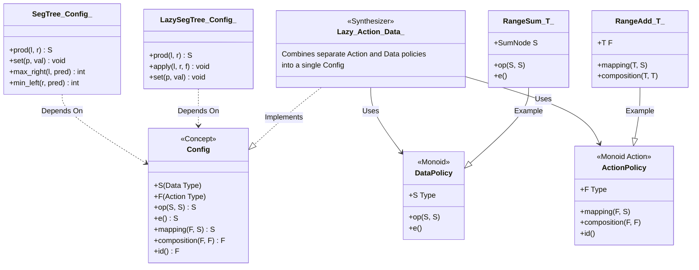

# CP Library Architecture

## Segment Tree Abstraction

The Segment Tree library uses a policy-based design pattern to separate the **Tree Structure** (logic) from the **Algebraic Operations** (data).

### Components

1.  **SegTree / LazySegTree**: The container classes. They handle the tree traversal, indexing, and complexity ($O(\log N)$). They don't know *what* they are calculating, only that it follows the Monoid laws.
2.  **Config**: The template argument. It tells the tree:
    *   `S`: What data is stored in nodes.
    *   `op`: How to combine two nodes.
    *   `F`: What lazily applied action looks like.
    *   `mapping`: How an action updates a node.
    *   `composition`: How two actions merge.
3.  **Policies**: Small, reusable structs (e.g., `RangeSum`, `RangeAdd`) that implement parts of the Config.
4.  **Lazy**: A convenience wrapper that stitches a `DataPolicy` and an `ActionPolicy` together to form a full `Config`.
